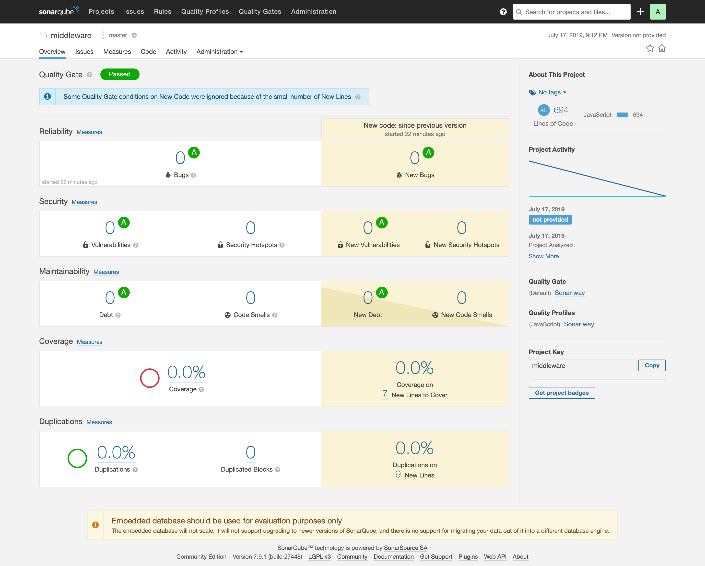

# turkcell-mobilim-middleware

[](http://localhost:9000/dashboard?id=middleware)

Middleware implemented for **Turkcell Mobilim App** POC

## Features

- Communicates with 
  - Turkcell backends (travel and award related flows)
  - [PostgreSQL](https://www.postgresql.org/) DB
  - [Elasticsearch](https://www.elastic.co/) server

- Includes
  - SOAP to REST translator (and vice versa)
  - [Caching](https://github.com/kwhitley/apicache) for certain endpoints
  - Logging mechanism for all requests & responses

## Prerequisites
- Docker (>=18.09.2)

## Installation
- Run the following command which will run the latest 
  - Elasticsearch (=7.2.0) 
  - Kibana (=7.2.0) Docker images
```
docker-compose up
```
- After both images are up and running go to the following links through your browser to make sure everything is working correctly
- Eleasticsearch is hosted at ```http://localhost:9200```
- Kibana is hosted at ```http://localhost:5601```
- Middleware is hosted at ```http://localhost:80```
  - If you navigate there you should be able to see the screen down below


## Notes

- [SonarScanner](https://www.sonarqube.org/) report can be found down below 


